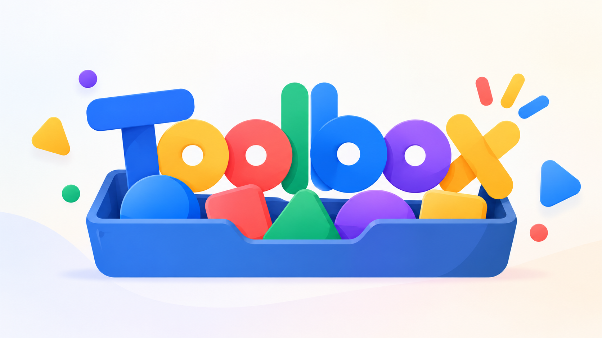

  

  
  

# Toolbox

A lightweight platform for building project-specific command-line interfaces.

Define actions through configuration, connect them to scripts or executables in any programming language, and run them through a consistent, human-readable CLI.

Toolbox provides the infrastructure, while developers retain full control over their tools. The platform stays simple, modular, and focused, introducing new capabilities only when real usage makes them necessary.

## License

This project is licensed under the MIT License - see the [LICENSE](LICENSE)
file for details.
